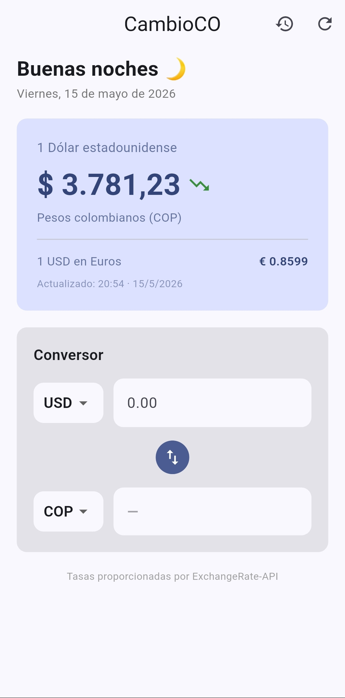
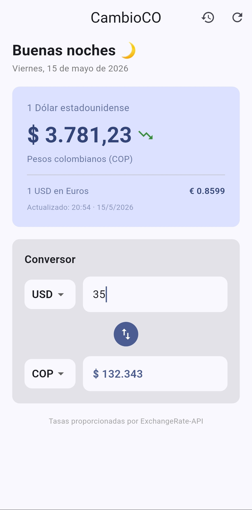
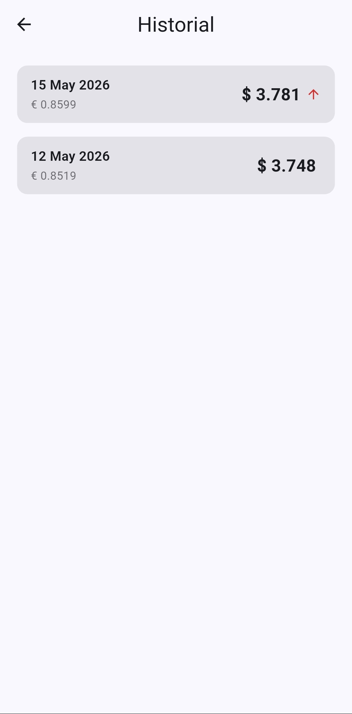

# CambioCO 💱

> Consulta la tasa del dólar en tiempo real y convierte entre COP, USD y EUR.
> Check the dollar exchange rate in real time and convert between COP, USD and EUR.

---

## Capturas de pantalla / Screenshots

<p align="center">
  
  
  
</p>

---

## Funcionalidades / Features

**Español**
- Tasa TRM en tiempo real (COP/USD/EUR)
- Indicador de tendencia — sube o baja vs consulta anterior
- Conversor interactivo entre COP, USD y EUR
- Historial de los últimos 10 días consultados
- Caché local — funciona sin internet si ya consultó antes
- Pull-to-refresh para actualizar manualmente

**English**
- Real-time exchange rate (COP/USD/EUR)
- Trend indicator — up or down vs previous consultation
- Interactive converter between COP, USD and EUR
- History of the last 10 consulted days
- Local cache — works offline if previously fetched
- Pull-to-refresh to manually update

---

## Stack técnico / Tech Stack

| Tecnología | Uso |
|---|---|
| Flutter 3.41.9 | Framework mobile |
| Dart 3.11.5 | Lenguaje |
| Provider | Manejo de estado |
| http | Llamadas REST |
| SharedPreferences | Caché y historial local |
| intl | Formato de números (COP) |
| ExchangeRate-API | Fuente de tasas de cambio |

---

## Arquitectura / Architecture

```
lib/
├── config/          # API keys (no incluidas en el repo)
├── models/          # ExchangeRate — modelo de datos
├── repositories/    # Lógica de API y caché
├── providers/       # Estado global con ChangeNotifier
├── screens/         # HomeScreen, HistoryScreen
└── widgets/         # RateCard, ConverterWidget
```

Patrón: **Repository + Provider (ChangeNotifier)**

---

## Configuración / Setup

### 1. Clonar el repositorio / Clone the repository
```bash
git clone https://github.com/tu-usuario/Flutter_cambioco.git
cd Flutter_cambioco
```

### 2. Configurar la API key / Set up the API key
```bash
cp lib/config/api_config.example.dart lib/config/api_config.dart
```
Abre `lib/config/api_config.dart` y reemplaza `TU_API_KEY_AQUÍ` con tu key gratuita de [ExchangeRate-API](https://www.exchangerate-api.com/).

### 3. Instalar dependencias / Install dependencies
```bash
flutter pub get
```

### 4. Correr la app / Run the app
```bash
flutter run
```

---

## Decisiones técnicas / Technical decisions

- **Caché de 1 hora** — evita llamadas innecesarias a la API y permite uso offline
- **Repository pattern** — desacopla la fuente de datos de la UI
- **Una entrada por día en el historial** — evita duplicados y mantiene el historial limpio

---

## Autor / Author

**Santiago Rojas**
- GitHub: [RojasVSantiago](https://github.com/RojasVSantiago)
- LinkedIn: [srojasv](https://www.linkedin.com/in/srojasv/)

---

## Licencia / License

MIT License — libre para usar y modificar.
